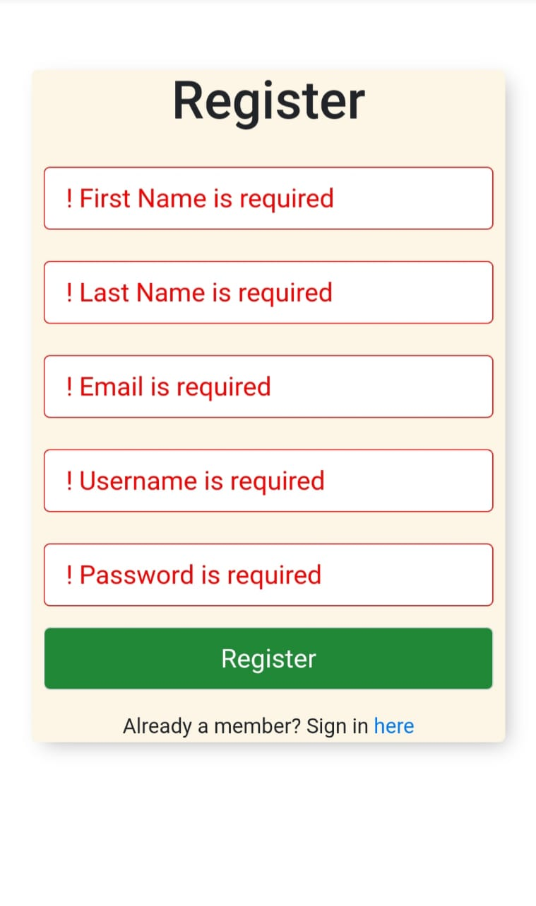
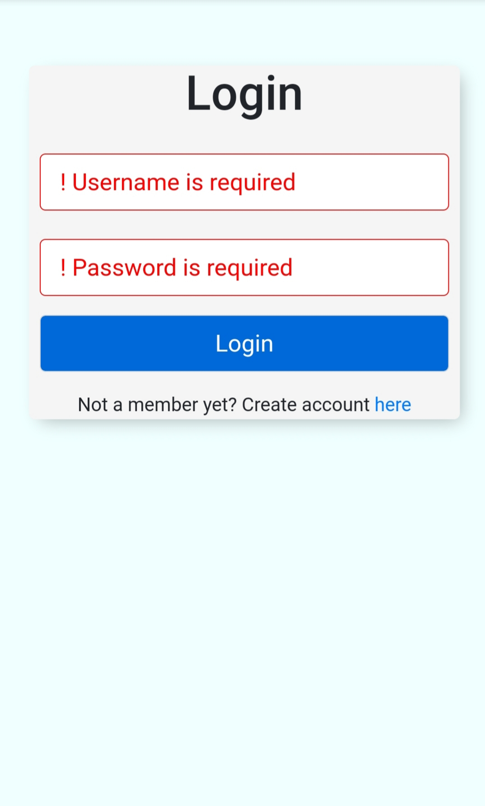
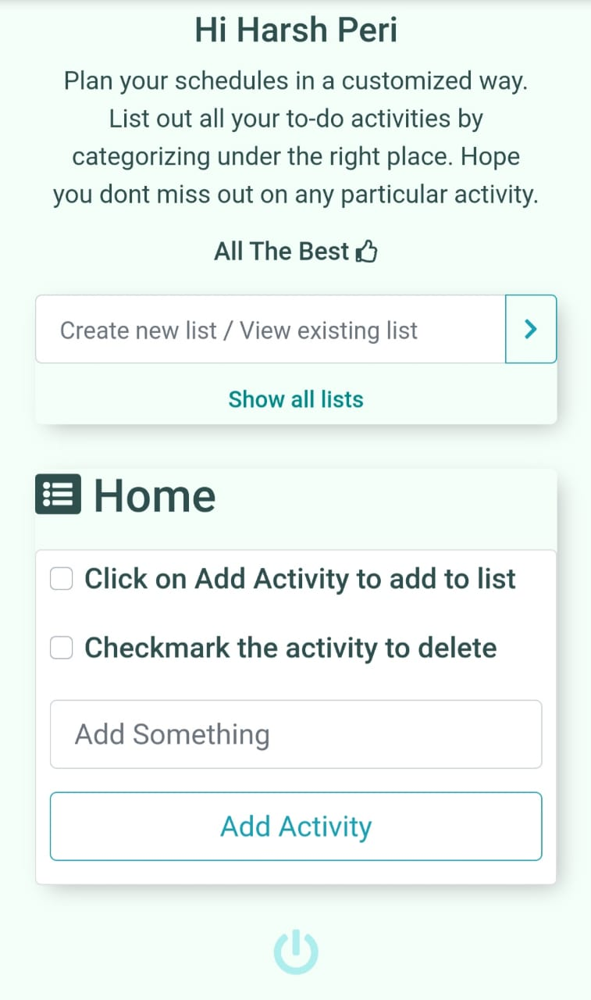
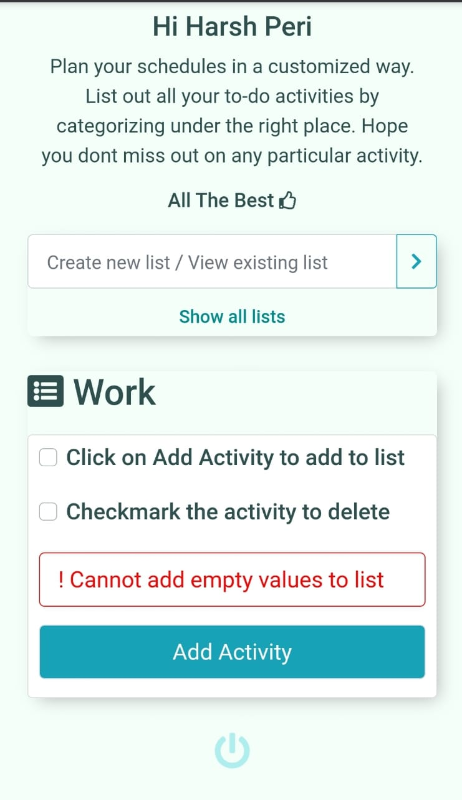
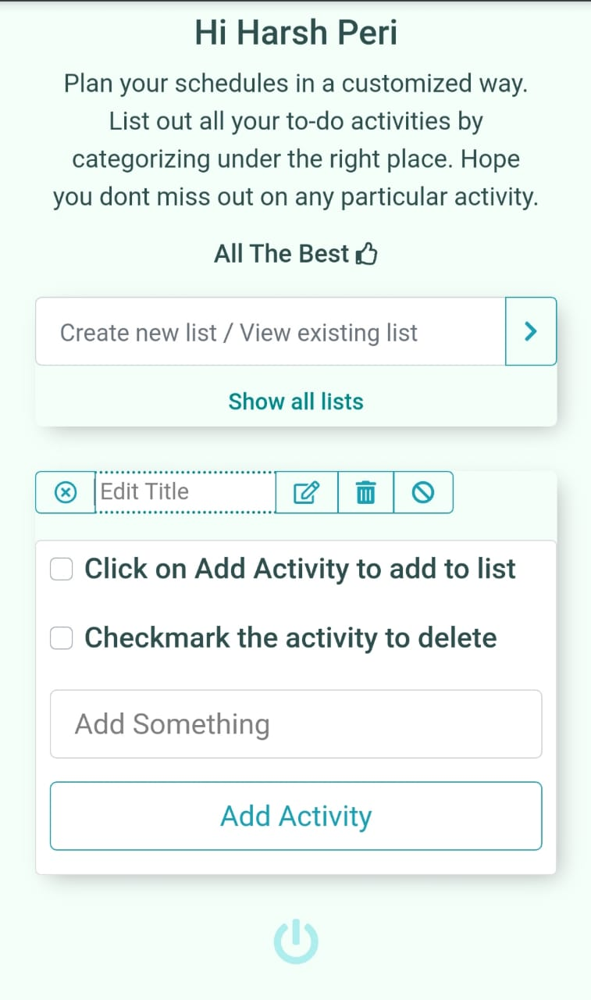
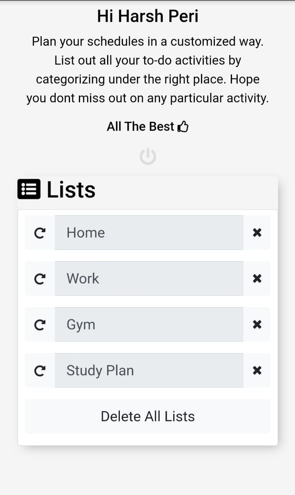

# CustomLists
A to-do-list application based on Express.js  (Hosted link : https://customlists.herokuapp.com/)

Overview: A web application which has been developed using Node.js on the server side with the support of Express.js framework with other npm modules as middlewares such as mongoose for connecting to MongoDB, lodash npm package for manipulating the text in the query string, ejs module for creating templates and using partials in the views, body-parser for handling the request parameters from the form requests.

Functionality: A to-do list application where user can make a list either in the default list provided or create a custom list. To create a custom list, a request has to be given to any route which will be dynamically handled and a list will be created with the name given by the user in the query string if the list does'nt exist, if alredy exists, then the existing list would be shown. User can add items through the input text field and delete items with the help of the checkbox provided which crosses off the item and deletes it immediately. The delete button at the bottom of the list is to delete any particular custom list but the default list. It is because default list has been considered as the home page for this application.

<label for="register" style="text-align:center;">Register</label>

